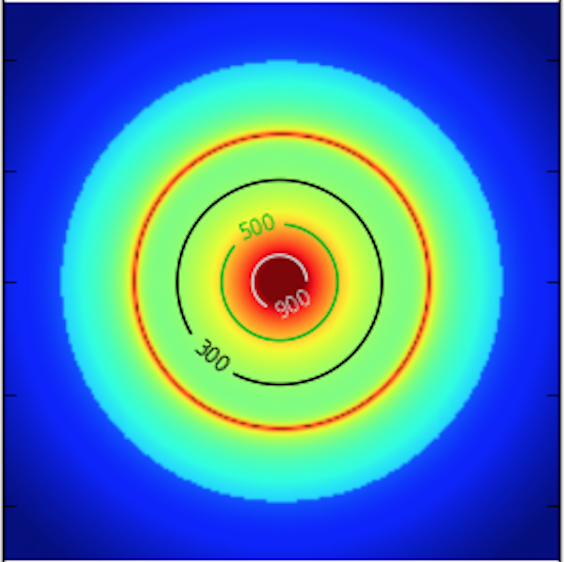
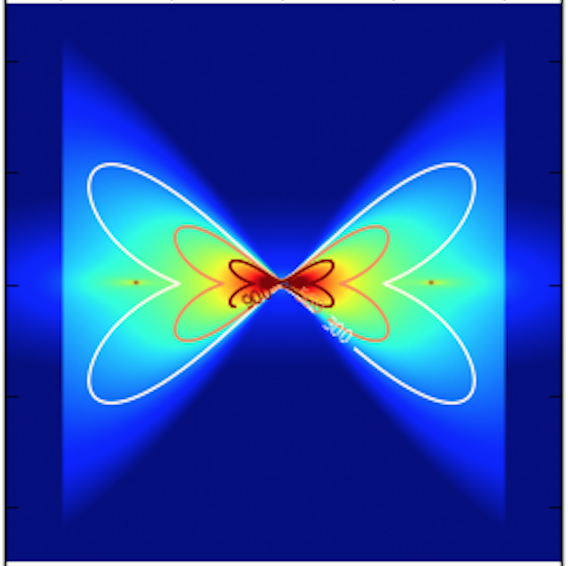
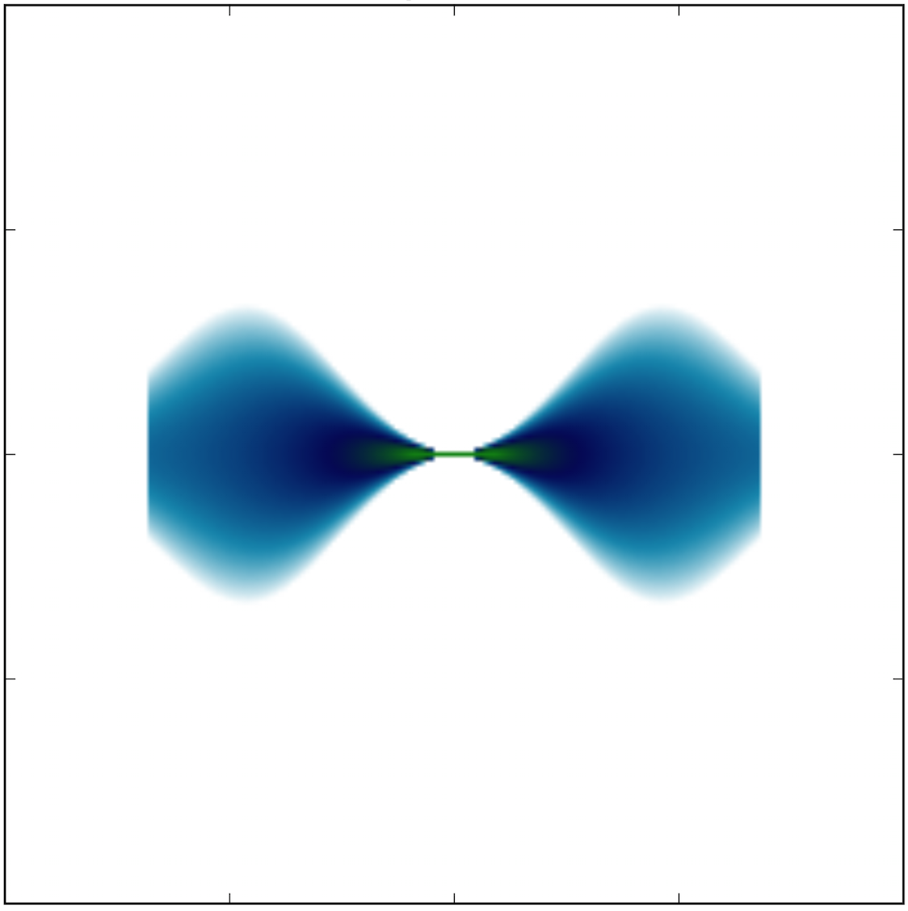
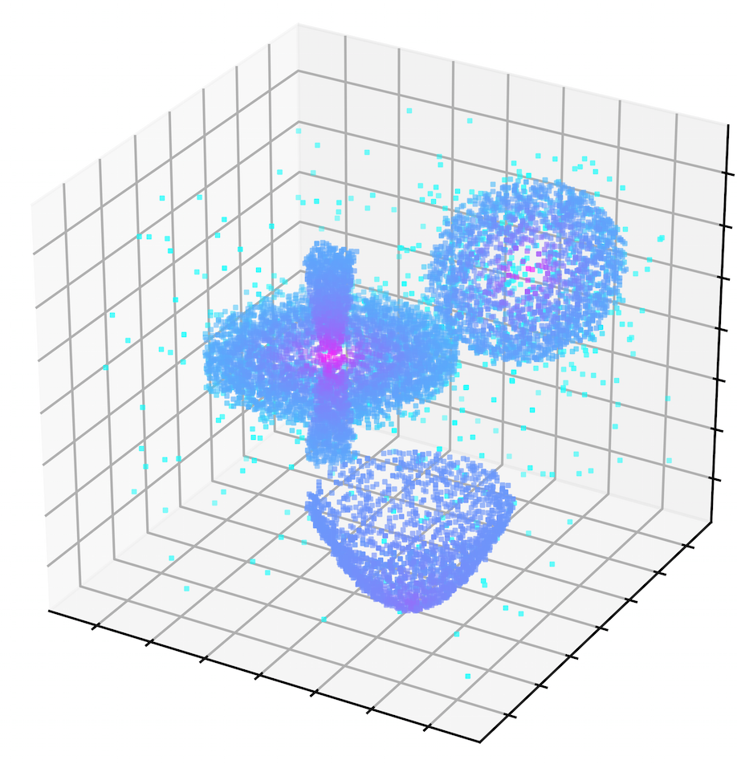
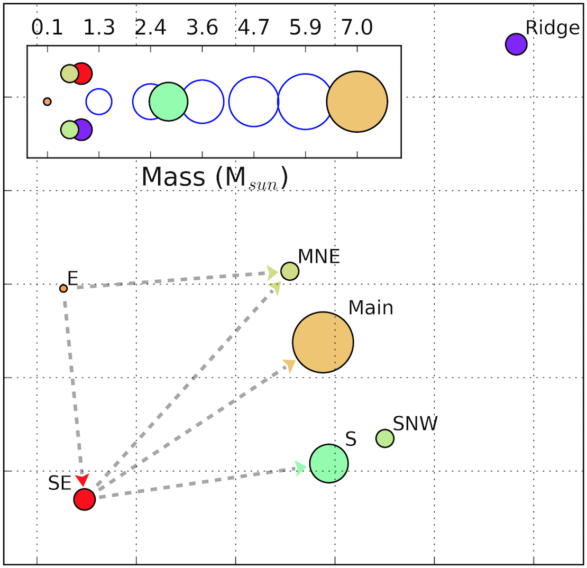
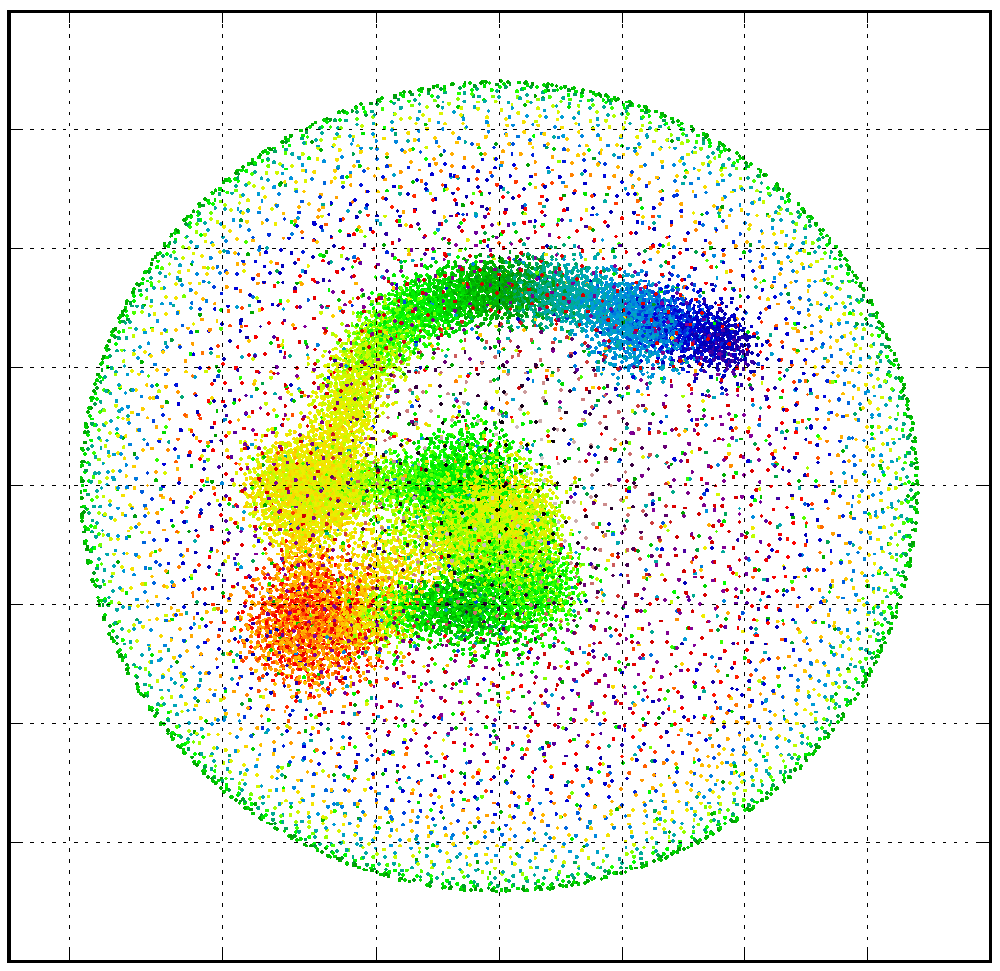

**********
sf3dmodels
**********
  
This is the documentation for the Star-Forming regions 3D Modelling package.

Find the source code on `GitHub`_.

.. image:: http://img.shields.io/badge/powered%20by-AstroPy-orange.svg?style=flat
    :target: http://www.astropy.org
    :alt: Powered by Astropy Badge

.. image:: https://img.shields.io/badge/ascl-2001.003-blue.svg?colorB=262255
    :target: http://ascl.net/2001.003
    :alt: ASCL Code Record

sf3dmodels is a star forming region(s) modelling package that brings together
analytical models in order to compute their physical properties in a 3-Dimensional grid. 
The package can couple different models in a single grid to recreate complex star
forming systems as those being revealed by current data. 
The output data can be read with `LIME`_ or `RADMC-3D`_
to carry out radiative transfer calculations of the model.

Requirements
============

* Python 2.7.x or 3.5.x (or later)
* `Astropy <http://docs.astropy.org/en/stable/install.html>`__
* `Numpy <https://www.scipy.org/install.html>`_
* `Matplotlib <https://matplotlib.org/users/installing.html>`_
* `IPython <https://ipython.org/install.html>`_ (optional, but recommended)

Installation
============

From source
-----------

Clone the star-forming-regions repository from `GitHub`_:

To clone the package, if you have a github account:

.. code-block:: bash

   git clone git@github.com:andizq/star-forming-regions.git

if you don't have one:

.. code-block:: bash

   git clone https://github.com/andizq/star-forming-regions.git

Get into the star-forming-regions cloned folder and run the **setup.py** script in installation mode:

.. code-block:: bash

   cd star-forming-regions
   python setup.py install

You can test whether the installation was successful by running a example from **star-forming-regions/examples**.

Upgrade the package
-------------------
   
.. code-block:: bash
   
   cd star-forming-regions
   git fetch --all
   git reset --hard origin/master
   git submodule update --force --remote -- lime
   python setup.py install

Uninstall
---------

.. code-block:: bash
   
   pip uninstall sf3dmodels

Using sf3dmodels
================

.. toctree::
  :maxdepth: 1
  
  examples.rst
  single_source/single_source.rst	
  two_sources/two_sources.rst
  ionized_sources/ionized_sources.rst

LIME in *sf3dmodels* mode
=========================

The package contains the standard LIME v1.9.5 + an additional feature for **sf3dmodels** users. 
An ingestor was included within the LIME source codes, it allows the user to employ the **sf3dmodels** output as the LIME input. 

Installation
------------

LIME must be configured separately once the **sf3dmodels** package has been installed with success. 

The installation procedure of this LIME is identical to its standard installation 
(have a look at the `LIME installation notes <https://github.com/andizq/lime/tree/sf3dmodels>`_ section). Make 
sure you are configuring and setting everything in/to the LIME directory included in this repository.

Running it
----------

The ingestor will look for the ``.dat`` files generated by **sf3dmodels** and load them within the LIME environment. 
To invoke this option, a ``-S`` flag (uppercase) must be added in the usual LIME running command as follows:

.. code-block:: bash

   lime -S model.c

The standard LIME command line options may also be invoked. For instance, to set LIME to 
(1.) produce normal output rather than the default ncurses output style, (2.)  
read the **sf3dmodels** output and (3.) run in parallel mode with 4 threads 
you should execute:

.. code-block:: bash

   lime -nS -p 4 model.c

**Note** that if the ``-S`` option *is not set* you will get back the 'traditional' operation of LIME.

LIME Examples
^^^^^^^^^^^^^

Take a look at the folders **lime/example** and **lime/example_sf3dmodels/** included in the package repository.

Reference/API
=============

.. automodapi:: sf3dmodels
   :no-inheritance-diagram:

.. toctree::
   :maxdepth: 1
   
   Model.rst
   Plot_model.rst
   utils/utils.rst

New on sf3dmodels
=================

.. toctree::
   :maxdepth: 1   
   
   filament/filament.rst
   outflow/outflow.rst
   radiativetransfer/rt.rst
   grid/overlap.rst
   
Working on...
=============

.. toctree::
   :maxdepth: 1   
   
   tools/tools.rst
   arepo/arepo.rst
   grid/grid.rst

Developers
==========

* `Andres Izquierdo <https://github.com/andizq>`_
* `Roberto Galvan-Madrid <https://github.com/rgalvanmadrid>`_
* `Adam Ginsburg <https://github.com/keflavich>`_
* `Luke Maud <https://local.strw.leidenuniv.nl/people/touchscreen2/persinline.php?id=1716>`_   

License
=======

This project is Copyright (c) Andres Izquierdo and licensed under
the terms of the BSD 3-Clause license. This package is based upon
the `Astropy package template <https://github.com/astropy/package-template>`_
which is licensed under the BSD 3-clause licence. See the licenses folder for
more information.

Citing sf3dmodels
=================

If you find **sf3dmodels** useful for your research please cite the work of `Izquierdo+2018`_::

   @ARTICLE{2018MNRAS.478.2505I,
      author = {{Izquierdo}, Andr{\'e}s F. and {Galv{\'a}n-Madrid}, Roberto and
                {Maud}, Luke T. and {Hoare}, Melvin G. and {Johnston}, Katharine G. and
         	{Keto}, Eric R. and {Zhang}, Qizhou and {de Wit}, Willem-Jan},
      title = "{Radiative transfer modelling of W33A MM1: 3D structure and dynamics of a complex massive star-forming region}",
      journal = {\mnras},
      keywords = {radiative transfer, stars: formation, stars: massive, stars: protostars, Astrophysics - Astrophysics of Galaxies, Astrophysics - Solar and Stellar Astrophysics},
      year = "2018",
      month = "Aug",
      volume = {478},
      number = {2},
      pages = {2505-2525},
      doi = {10.1093/mnras/sty1096},
      archivePrefix = {arXiv},
      eprint = {1804.09204},
      primaryClass = {astro-ph.GA},
      adsurl = {https://ui.adsabs.harvard.edu/abs/2018MNRAS.478.2505I},
      adsnote = {Provided by the SAO/NASA Astrophysics Data System}
   }

   
.. warning:: This package, as well as its documentation, are currently under development and may often undergo modifications.
