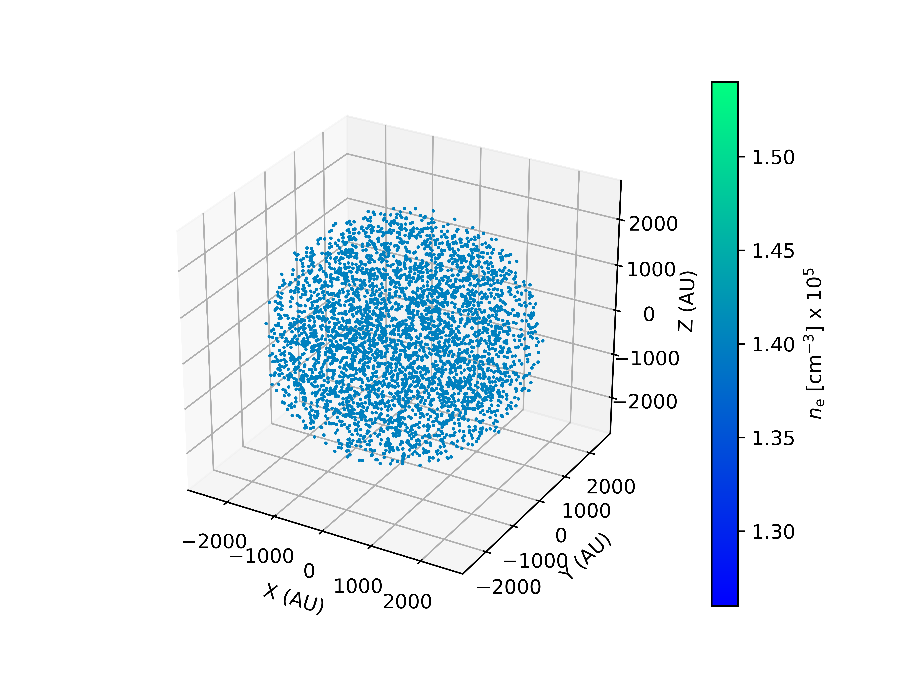
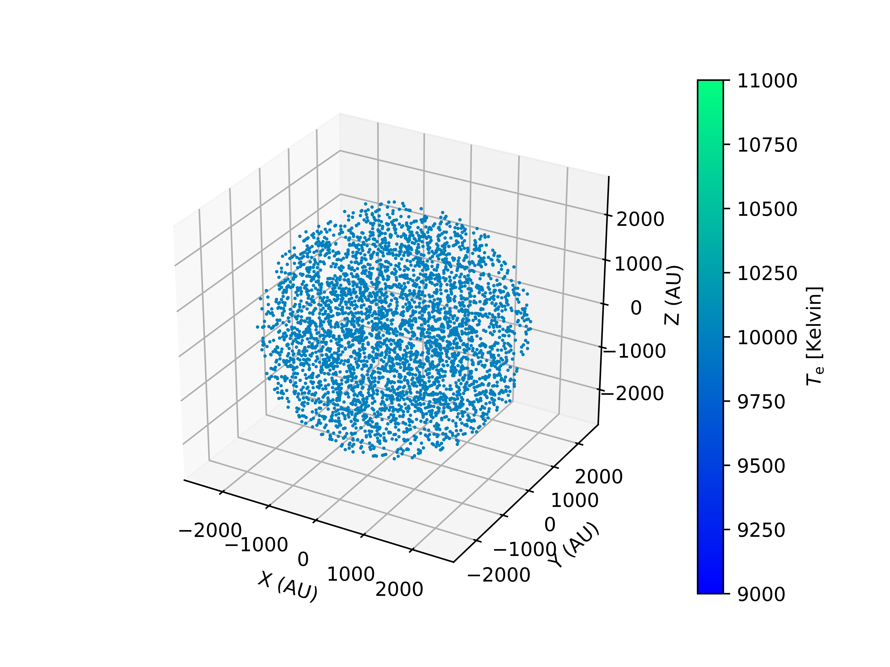

Modelling HII regions. *RT with RADMC-3D*
=========================================

Example 1
---------

Source codes and figures on GitHub: `ionized_constant <https://github.com/andizq/star-forming-regions/tree/master/examples/ionized_constant>`_

.. note::
   `Uniform spherical HII region`
   
   `Model`: *Constant density and temperature*
   
   `Useful references`: `Pratap+1992`_, `Keto+2008`_

You can create electronic density distributions with the ``Model`` library and call 
the ``Datatab_RADMC3D_FreeFree`` module to obtain formatted data files that may be used 
later to predict the Free-Free emission of the region with `RADMC-3D`_.

**The preamble**:  

.. code-block:: python

   #------------------
   #Import the package
   #------------------
   from sf3dmodels import *
   #-----------------
   #Extra libraries
   #-----------------
   import numpy as np
   import time

**a.** Define the general parameters and the GRID:

.. note:: The ``radmc3d`` flag must be turned on at the GRID definition (see below)

.. code-block:: python

   #------------------
   #General Parameters
   #------------------
   r_max = 2530 * U.AU #HII sphere size
   dens_e = 1.4e5 * 1e6 #Electronic numerical density, from cgs to SI
   t_e = 1.e4 #K

   #---------------
   #GRID Definition
   #---------------
   sizex = sizey = sizez = 2600 * U.AU 
   Nx = Ny = Nz = 63 #Number of divisions for each axis
   GRID = Model.grid([sizex, sizey, sizez], [Nx, Ny, Nz], radmc3d = True)
   NPoints = GRID.NPoints #Final number of nodes in the grid

**b.** Invoke the ``Model`` library to compute the physical properties at each node in the ``GRID``:

.. code-block:: python

   #-------------------
   #PHYSICAL PROPERTIES
   #-------------------
   density = Model.density_Constant(r_max, GRID, envDens = dens_e)
   temperature = Model.temperature_Constant(density, GRID, envTemp = t_e, backTemp=2.725)

**c.** Write the data into a file with the RADMC-3D format:

.. code-block:: python

   #---------------------------------
   #WRITING DATA with RADMC-3D FORMAT
   #---------------------------------
   Model.Datatab_RADMC3D_FreeFree(density.total, temperature.total, GRID)

**d.** Plot the 3D spatial points distribution:

.. code-block:: python

   #------------------------------------
   #3D PLOTTING (weighting with density)
   #------------------------------------
   tag = 'HII'
   weight = dens_e
   Plot_model.scatter3D(GRID, density.total, weight, NRand = 4000, 
   			colordim = density.total / 1e6 / 1e5, axisunit = U.AU, 
			cmap = 'winter', marker = 'o', 
			colorlabel = r'$n_{\rm e}$ [cm$^{-3}$]', 
			output = '3Ddens_%s.png'%tag, show = True)

   Plot_model.scatter3D(GRID, density.total, weight, NRand = 4000, 
   			colordim = temperature.total, axisunit = U.AU, 
			cmap = 'winter', marker = 'o', 
			colorlabel = r'$T_{\rm e}$ [Kelvin]', 
			output = '3Dtemp_%s.png'%tag, show = True)

Running RADMC-3D
^^^^^^^^^^^^^^^^

To get the SED of the region just run the following command in the folder 
where you stored the ``sf3dmodels`` output data files (**.inp**'s):

.. code-block:: bash

   $ radmc3d sed

A file named ``spectrum.out`` containing the SED information was written
in your working directory. Let's use it to construct the SED plot of the region,
at a distance of 4 kpc:

.. code-block:: python

   from radmc3dPy.analyze import *
   import matplotlib.pyplot as plt

   tag = 'ctsphere'

   s = readSpectrum(fname = 'spectrum.out') #column 0: wavelength in microns; column 1: Flux in cgs. 
   distance = 4000. #in pc. The spectrum.out file is still normalized to a distance of 1 pc (see radmc3d docs)
   F_nu = s[:,1] * distance**-2 * 1e23 #to Jy at the set distance
   nu = 3e8 * s[:,0]**-1 * 1e6 * 1e-9 #microns to GHz
   plt.plot(nu, F_nu)
   plt.title('%s - distance: %d pc'%(tag,distance))
   plt.xlabel('Frequency [GHz]'); plt.ylabel('Flux [Jy]')
   plt.xscale('log'); plt.yscale('log')
   plt.savefig('sed_'+tag+'.png')
   plt.show()

Example 2
---------
**d.** Plot a random-weighted 3D points distribution based on the physical properties of the model: