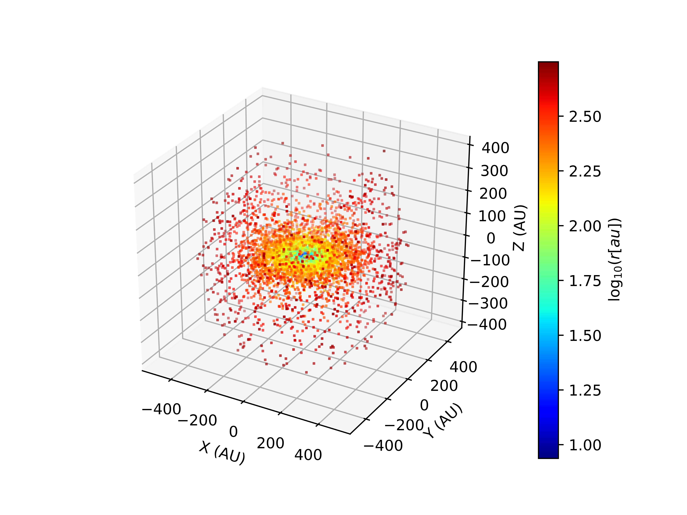
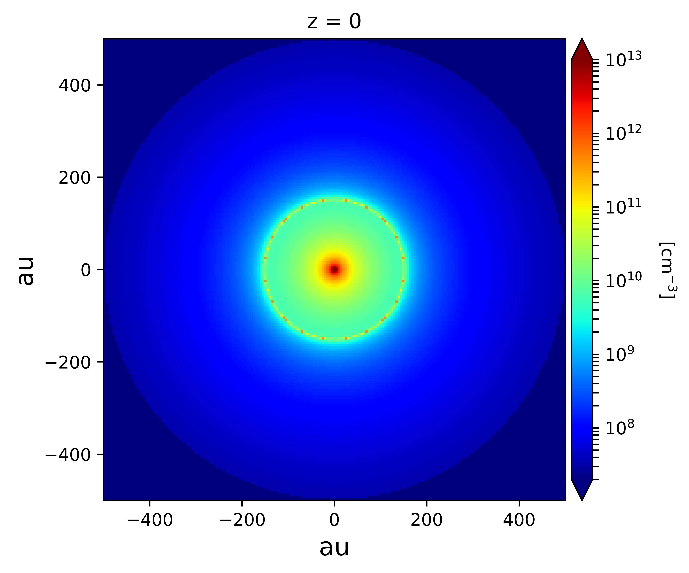
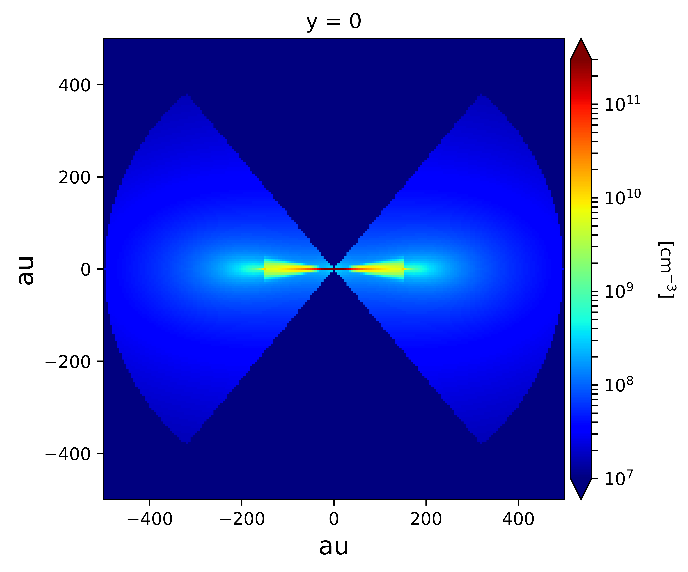
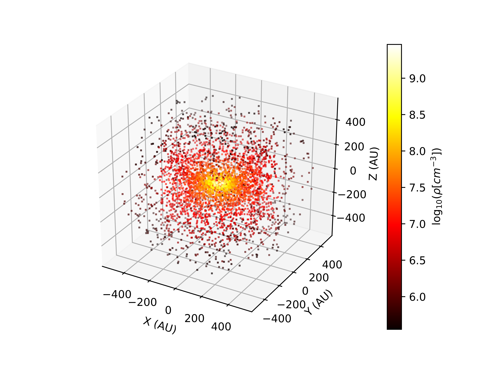
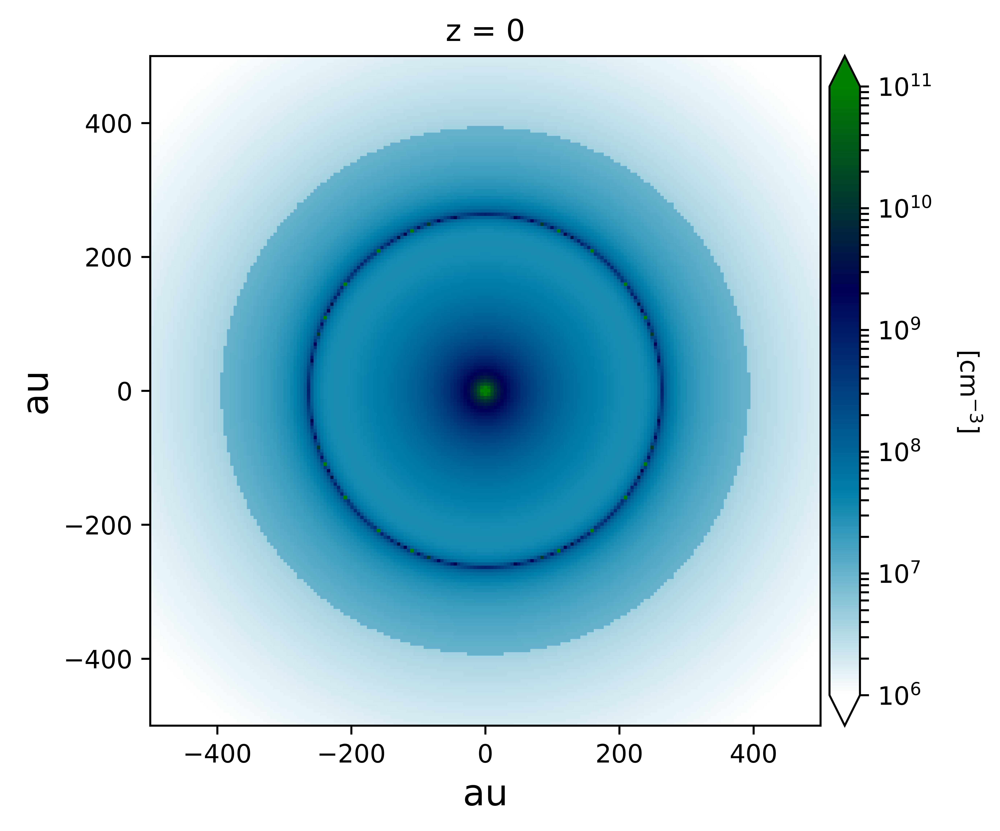
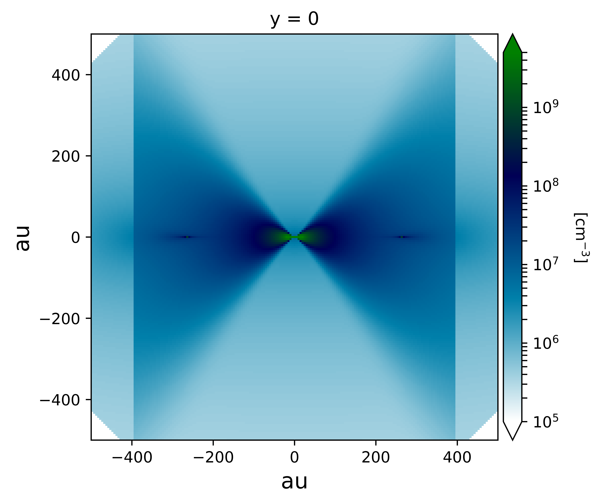
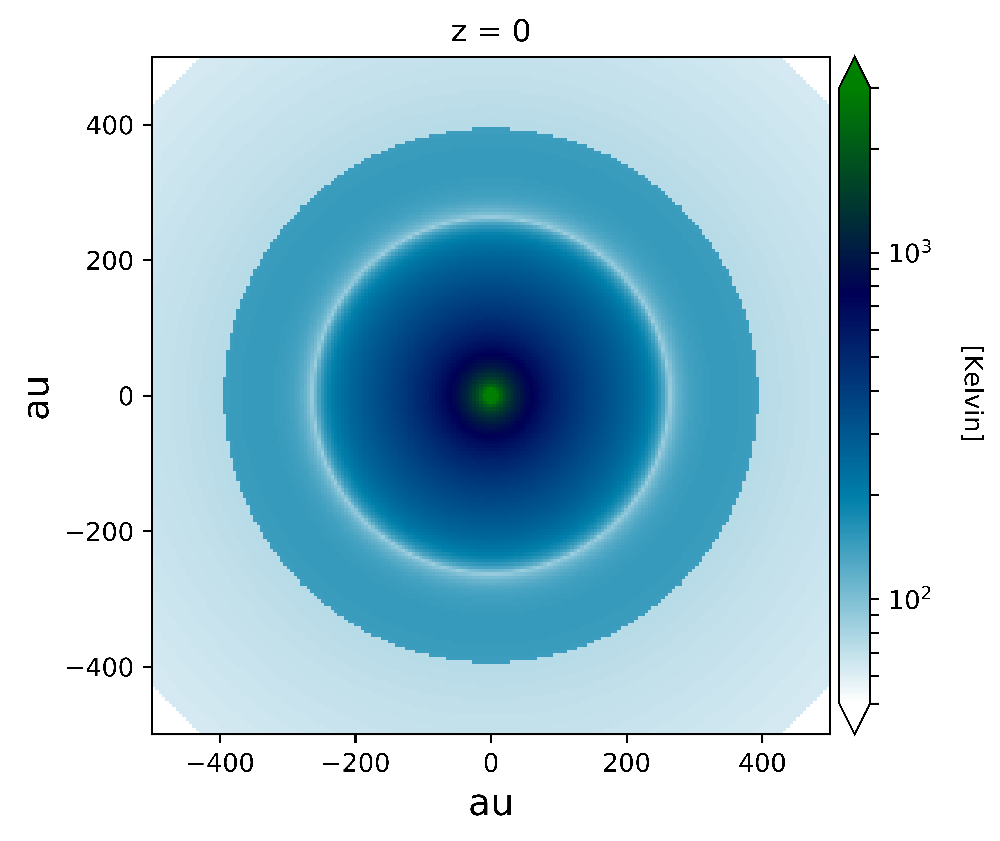
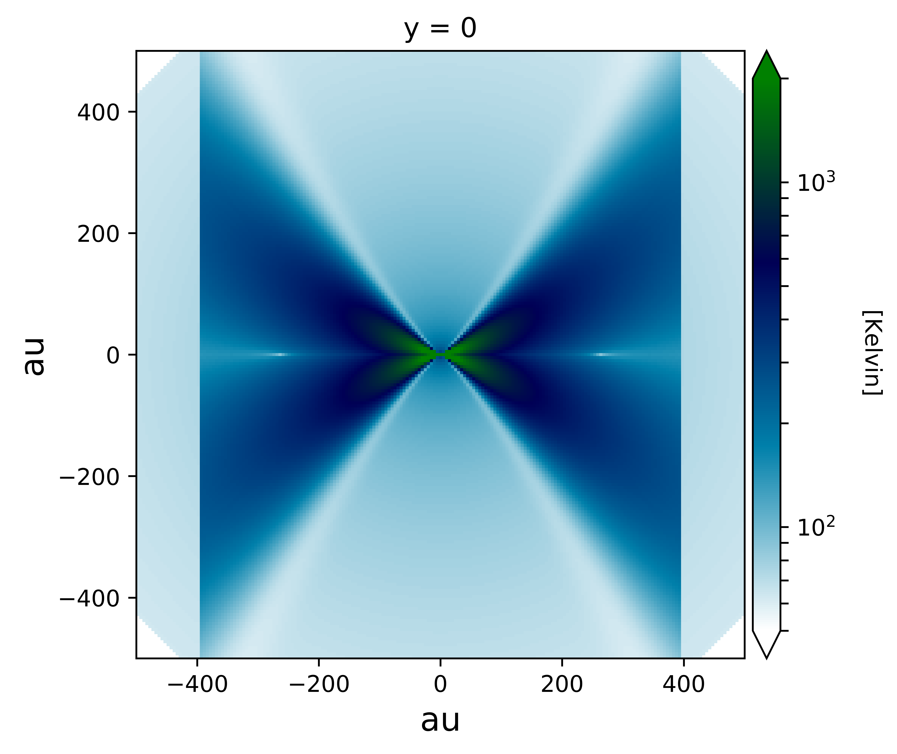
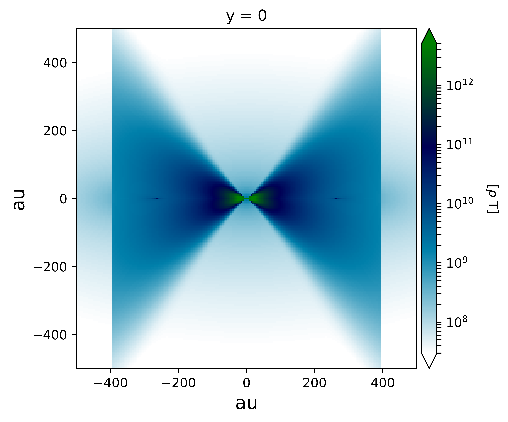

Modelling a single star forming region
=======================================

Example 1
---------

Source code and figures on GitHub: `single_main <https://github.com/andizq/star-forming-regions/tree/master/examples/single_main>`_  

.. note:: 
   `W33A MM1-Main`: The most massive compact source of the complex star forming region W33A MM1. 
   
   `Model`: *Ulrich envelope + Pringle disc*.

   `Useful references`: `Keto+2010`_, `Galvan-Madrid+2010`_, `Maud+2017`_, `Izquierdo+2018`_

**The preamble**:

.. code-block:: python

   #------------------
   #Import the package
   #------------------
   from sf3dmodels import *
   #-----------------
   #Extra libraries
   #-----------------
   from matplotlib import colors
   import numpy as np
   import os
   import time

   t0 = time.time()

**a.** Let's define some general parameters:

.. code-block:: python

   MStar = 7.0 * U.MSun
   MRate = 4e-4 * U.MSun_yr #Mass accretion rate                                                                                                         
   RStar = 26 * U.RSun * ( MStar/U.MSun )**0.27 * ( MRate / (1e-3*U.MSun_yr) )**0.41                                                                                                               
   LStar = 3.2e4 * U.LSun
   TStar = U.TSun * ( (LStar/U.LSun) / (RStar/U.RSun)**2 )**0.25                                                                                       
   Rd = 152. * U.AU #Centrifugal radius  

   print ('RStar:', RStar/U.RSun, ', LStar:', LStar/U.LSun, ', TStar:', TStar)

**b.** Create the grid that will host the region:

.. code-block:: python

   # Cubic grid, each edge ranges [-500, 500] AU.
   sizex = sizey = sizez = 500 * U.AU
   Nx = Ny = Nz = 150 #Number of divisions for each axis
   GRID = Model.grid([sizex, sizey, sizez], [Nx, Ny, Nz])
   NPoints = GRID.NPoints #Number of nodes in the grid
	

**c.** Invoke the physical properties from a desired model(s):

.. code-block:: python

   #--------
   #DENSITY
   #--------
   Rho0 = Res.Rho0(MRate, Rd, MStar) #Base density for Ulrich's model
   Arho = 24.1 #Disc-envelope density factor
   Renv = 500 * U.AU #Envelope radius
   Cavity = 40 * np.pi/180 #Cavity opening angle
   density = Model.density_Env_Disc(RStar, Rd, Rho0, Arho, GRID, 
   	     		            discFlag = True, envFlag = True, 
				    renv_max = Renv, ang_cavity = Cavity)
				 
   #-----------
   #TEMPERATURE
   #-----------
   T10Env = 375. #Envelope temperature at 10 AU                                                                                                              
   BT = 5. #Adjustable factor for disc temperature. Extra, or less, disc heating.
   temperature = Model.temperature(TStar, Rd, T10Env, RStar, MStar, MRate, 
   	       	 		   BT, density, GRID, ang_cavity = Cavity)

   #--------
   #VELOCITY
   #--------
   vel = Model.velocity_Ulrich(RStar, MStar, Rd, density, GRID)

   #-------------------------------
   #ABUNDANCE and GAS-to-DUST RATIO
   #-------------------------------
   ab0 = 1.8e-7 #CH3CN abundance                                                                                                           
   abundance = Model.abundance(ab0, NPoints) #Constant abundance

   gtd0 = 100. #Gas to dust ratio
   gtdratio = Model.gastodust(gtd0, NPoints) #Constant gtd ratio

**d.** Plot the modelled region: 

.. code-block:: python

   #-----------------------------------------------
   #3D Points Distribution (weighting with density)
   #-----------------------------------------------
   tag = 'Main'
   dens_plot = density.total / 1e6

   weight = 10*Rho0
   r = GRID.rRTP[0] / U.AU #GRID.rRTP hosts [r, R, Theta, Phi] --> Polar GRID
   Plot_model.scatter3D(GRID, density.total, weight, 
   			NRand = 4000, colordim = r, axisunit = U.AU, 
			cmap = 'jet', colorscale = 'log', 
			colorlabel = r'${\rm log}_{10}(r [au])$', 
			output = '3Dpoints%s.png'%tag, show = False) 

.. code-block:: python

   #---------------------
   #2D PLOTTING (Density)
   #---------------------

   vmin, vmax = np.array([2e13, 1e19]) / 1e6
   norm = colors.LogNorm(vmin=vmin, vmax=vmax)

   Plot_model.plane2D(GRID, dens_plot, axisunit = U.AU, 
   		      cmap = 'jet', plane = {'z': 0*U.AU},
		      norm = norm, colorlabel = r'$[\rm cm^{-3}]$', 
		      output = 'DensMidplane_%s.png'%tag, show = False)

.. code-block:: python

   vmin, vmax = np.array([1e13, 3e17]) / 1e6
   norm = colors.LogNorm(vmin=vmin, vmax=vmax)

   Plot_model.plane2D(GRID, dens_plot, axisunit = U.AU, 
   		      cmap = 'jet', plane = {'y': 0*U.AU},
		      norm = norm, colorlabel = r'$[\rm cm^{-3}]$', 
		      output = 'DensVertical_%s.png'%tag, show = False)

**e.** Write the numbers into a file, in this case readable in LIME:

.. code-block:: python

   #-------------------------------------
   #WRITING DATA into file in LIME format
   #-------------------------------------
   Model.DataTab_LIME(density.total, temperature.total, vel, abundance, gtdratio, GRID)

**f.** And print some useful information:

.. code-block:: python

   Model.PrintProperties(density, temperature, GRID)
   print ('Ellapsed time: %.3fs' % (time.time() - t0)) #TIMING

Example 2
---------

Source code and figures on GitHub: `hamburger_standard <https://github.com/andizq/star-forming-regions/tree/master/examples/hamburger_standard>`_

.. note:: 
   `Standard Hamburger`: Class 0/I Young Stellar Object with self-obscuration in the (sub)mm spectral indices.
   
   `Model`: *Ulrich envelope + Hamburger disc*.

   `Useful references`: `Lee+2017b`_, `Li+2017`_, Galvan-Madrid+2018 (Submitted to ApJ)

**The preamble**: same as Example 1

**a.** The general parameters:

.. code-block:: python

   MStar = 0.86 * U.MSun 
   MRate = 5.e-6 * U.MSun_yr 
   RStar = U.RSun * ( MStar/U.MSun )**0.8 
   LStar = U.LSun * ( MStar/U.MSun )**4 
   TStar = U.TSun * ( (LStar/U.LSun) / (RStar/U.RSun)**2 )**0.25 
   Rd = 264. * U.AU

   print ('RStar:', RStar/U.RSun, ', LStar:', LStar/U.LSun, ', TStar:', TStar)

**b.** The grid:

.. code-block:: python

   #Cubic grid, each edge ranges [-500, 500] AU.
   sizex = sizey = sizez = 500 * U.AU
   Nx = Ny = Nz = 200 #Number of divisions for each axis
   GRID = Model.grid([sizex, sizey, sizez], [Nx, Ny, Nz])
   NPoints = GRID.NPoints #Number of nodes in the grid

**c.** The physical properties. 

.. note:: 
   The final density **Structure** should be defined by merging both the **Envelope density** and the **Disc density** (as shown in the following lines) since they were calculated separately from 2 different models.

.. code-block:: python
 
   #-------------
   #DENSITY
   #-------------

   #--------
   #ENVELOPE
   #--------
   Rho0 = Res.Rho0(MRate, Rd, MStar)
   Arho = None
   Renv = 2.5 * Rd
   densEnv = Model.density_Env_Disc(RStar, Rd, Rho0, Arho, GRID, 
   	     			    discFlag = False, envFlag = True, 
				    renv_max = Renv)
   #-------
   #DISC
   #-------
   H0sf = 0.03 #Disc scale height factor (H0 = H0sf * RStar)
   Arho = 5.25 #Disc density factor
   Rdisc = 1.5 * Rd
   densDisc = Model.density_Hamburgers(RStar, H0sf, Rd, Rho0, Arho, GRID, 
   	      			       discFlag = True, 
				       rdisc_max = Rdisc)
   #---------------------
   #The COMPOSITE DENSITY
   #---------------------
   density = Model.Struct( **{ 'total': densEnv.total + densDisc.total,
			       'disc': densDisc.total, 
			       'env': densEnv.total,
			       'H': densDisc.H,
			       'Rt': densDisc.Rt,
			       'discFlag': True,
			       'envFlag': True,
			       'r_disc': densDisc.r_disc, 
			       'r_env': densEnv.r_env,
			       'streamline': densEnv.streamline} )

   #-----------
   #TEMPERATURE
   #-----------
   T10Env = 250. #Envelope temperature at 10 AU
   Tmin = 10. #Minimum possible temperature. Every node with T<Tmin will inherit Tmin. 
   BT = 60. #Adjustable factor for disc temperature. Extra, or less, disc heating.
   temperature = Model.temperature_Hamburgers(TStar, RStar, MStar, MRate, Rd, 
   	       	 			      T10Env, BT, density, GRID, 
					      Tmin_disc = Tmin, inverted = False)

   #--------
   #VELOCITY
   #--------
   vel = Model.velocity(RStar, MStar, Rd, density, GRID)

   #-------------------------------
   #ABUNDANCE and GAS-to-DUST RATIO
   #-------------------------------
   ab0 = 5e-8 #CH3CN abundance vs H2
   abundance = Model.abundance(ab0, NPoints)

   gtd0 = 100. #Gas to dust ratio (H2 vs Dust)
   gtdratio = Model.gastodust(gtd0, NPoints)

**d.** Plot the modelled region: 

.. code-block:: python

   #----------------------------------------
   #3D PLOTTING (weighting with temperature)
   #----------------------------------------
   tag = 'Burger'
   dens_plot = density.total / 1e6

   vmin, vmax = np.array([5e11, 5e15]) / 1e6
   norm = colors.LogNorm(vmin=vmin, vmax=vmax)

   weight = 10*T10Env
   Plot_model.scatter3D(GRID, temperature.total, weight, NRand = 4000, 
   			colordim = dens_plot, axisunit = U.AU, cmap = 'hot', 
			norm = norm,
			colorlabel = r'${\rm log}_{10}(\rho [cm^{-3}])$', 
			output = '3Dpoints%s.png'%tag, show = False)

.. code-block:: python

   #----------------------------------------
   #2D PLOTTING (Density and Temperature)
   #----------------------------------------

   vmin, vmax = np.array([1e12, 1e17]) / 1e6
   norm = colors.LogNorm(vmin=vmin, vmax=vmax)

   Plot_model.plane2D(GRID, dens_plot, axisunit = U.AU, 
   	              cmap = 'ocean_r', plane = {'z': 0*U.AU},
		      norm = norm, colorlabel = r'$[\rm cm^{-3}]$', 
		      output = 'DensMidplane_%s.png'%tag, show = False)

.. code-block:: python

   vmin, vmax = np.array([1e11, 5e15]) / 1e6
   norm = colors.LogNorm(vmin=vmin, vmax=vmax)

   Plot_model.plane2D(GRID, dens_plot, axisunit = U.AU, 
   	              cmap = 'ocean_r', plane = {'y': 0*U.AU},
		      norm = norm, colorlabel = r'$[\rm cm^{-3}]$', 
		      output = 'DensVertical_%s.png'%tag, show = False)

.. code-block:: python

   vmin, vmax = np.array([5e1, 3e3])
   norm = colors.LogNorm(vmin=vmin, vmax=vmax)

   Plot_model.plane2D(GRID, temperature.total, axisunit = U.AU, 
   		      cmap = 'ocean_r', plane = {'z': 0*U.AU},
		      norm = norm, colorlabel = r'[Kelvin]', 
		      output = 'TempMidplane_%s.png'%tag, show = False)

.. code-block:: python

   vmin, vmax = np.array([5e1, 2e3])
   norm = colors.LogNorm(vmin=vmin, vmax=vmax)

   Plot_model.plane2D(GRID, temperature.total, axisunit = U.AU, 
   		      cmap = 'ocean_r', plane = {'y': 0*U.AU},
		      norm = norm, colorlabel = r'[Kelvin]', 
		      output = 'TempVertical_%s.png'%tag, show = False)

.. code-block:: python

   vmin, vmax = np.array([3e7, 5e12])
   norm = colors.LogNorm(vmin=vmin, vmax=vmax)

   Plot_model.plane2D(GRID, temperature.total * dens_plot, axisunit = U.AU, 
   		      cmap = 'ocean_r', plane = {'y': 0*U.AU},
		      norm = norm, colorlabel = r'[$\rho$ T]', 
		      output = 'Emissivity_%s.png'%tag, show = False)

**e.** Write the data into a file:

.. code-block:: python

   #-------------------------------------
   #WRITING DATA into file in LIME format
   #-------------------------------------
   Model.DataTab_LIME(density.total, temperature.total, vel, abundance, gtdratio, GRID) 

**f.** To finish, print some useful information:

.. code-block:: python

   Model.PrintProperties(density, temperature, GRID)
   print ('Ellapsed time: %.3fs' % (time.time() - t0)) #TIMING

Example 3
---------
