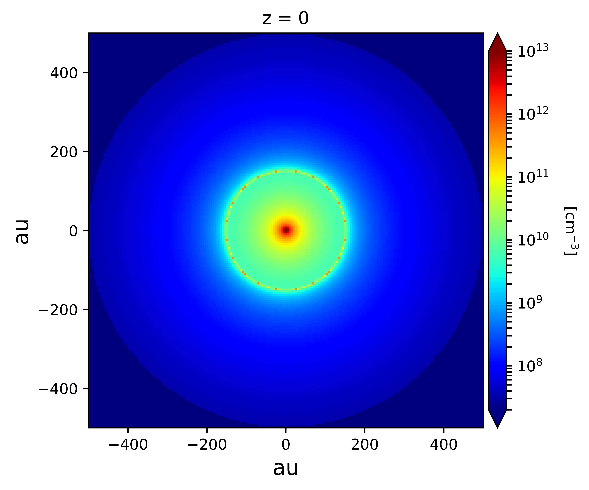

Modelling a single star forming region
=======================================

Source code and figures on GitHub: `single_region <https://github.com/andizq/star-forming-regions/tree/master/examples/single_source>`_  

.. note:: 
   `W33A MM1-Main`: Most massive compact source of a complex star forming region. 
   
   `Model`: *Ulrich envelope + Pringle disc*.

   `Useful references`: `Galvan-Madrid+2010`_, `Maud+2017`_ & `Izquierdo+2018`_

The preamble:

.. code-block:: python

   #------------------
   #Import the package
   #------------------
   from sf3dmodels import *
   #-----------------
   #Extra libraries
   #-----------------
   import numpy as np
   import os
   import time

**a.** Define some general parameters:

.. code-block:: python

   >>> MStar = 7.0 * U.MSun
   MRate = 4e-4 * U.MSun_yr #Mass accretion rate                                                                                                         
   RStar = 26 * U.RSun * ( MStar/U.MSun )**0.27 * ( MRate / (1e-3*U.MSun_yr) )**0.41                                                                                                               
   LStar = 3.2e4 * U.LSun
   TStar = U.TSun * ( (LStar/U.LSun) / (RStar/U.RSun)**2 )**0.25                                                                                       
   Rd = 152. * U.AU #Centrifugal radius  

**b.** Create the grid that will host the region:

.. code-block:: python

   # Cubic grid, each edge ranges [-500, 500] AU.

   sizex = sizey = sizez = 500 * U.AU
   Nx = Ny = Nz = 150 #Number of divisions for each axis
   GRID = Model.grid([sizex, sizey, sizez], [Nx, Ny, Nz])
   NPoints = GRID.NPoints #Number of nodes in the grid
	

**c.** Invoke the physical properties from a desired model(s):

.. code-block:: python

   #--------
   #DENSITY
   #--------
   Rho0 = Res.Rho0(MRate, Rd, MStar) #Base density for Ulrich model
   Arho = 24.1 #Disc-envelope density factor
   Renv = 500 * U.AU #Envelope radius
   Cavity = 40 * np.pi/180 #Cavity opening angle
   density = Model.density_Env_Disc(RStar, Rd, Rho0, Arho, GRID, 
   	     		            discFlag = True, envFlag = True, 
				    renv_max = Renv, ang_cavity = Cavity)
				 

   #-----------
   #TEMPERATURE
   #-----------
   p = 0
   T10Env = 375. #Envelope temperature at 10 AU                                                                                                              
   BT = 5. #Adjustable factor for disc temperature. Extra, or less, disc heating.
   temperature = Model.temperature(TStar, Rd, T10Env, RStar, MStar, MRate, 
   	       	 		   BT, p, density, GRID, ang_cavity = Cavity)

   #--------
   #VELOCITY
   #--------
   vel = Model.velocity_Ulrich(RStar, MStar, Rd, density, GRID)

   #-------------------------------
   #ABUNDANCE and GAS-to-DUST RATIO
   #-------------------------------
   ab0 = 1.8e-7 #CH3CN abundance                                                                                                           
   abundance = Model.abundance(ab0, NPoints) #Constant abundance

   gtd0 = 100. #Gas to dust ratio
   gtdratio = Model.gastodust(gtd0, NPoints) #Constant gtd ratio

**d.** Write the data into a file with the LIME format:

.. code-block:: python

   #-----------------------------
   #WRITING DATA with LIME format
   #-----------------------------
   Model.DataTab_LIME(density.total, temperature.total, vel, abundance, gtdratio, GRID)

**e.** Plot the results:

