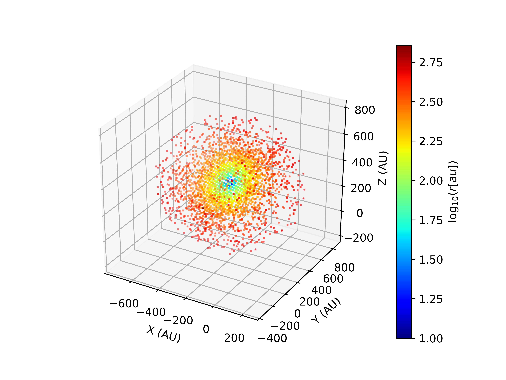
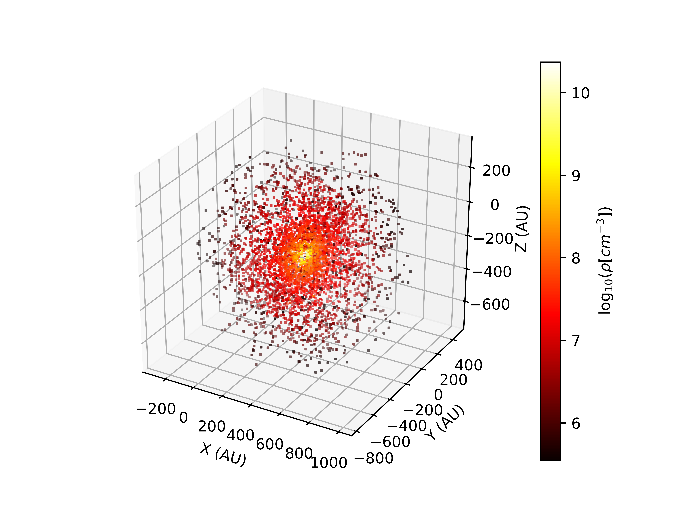
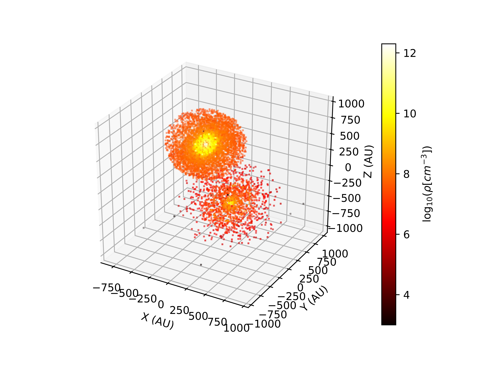
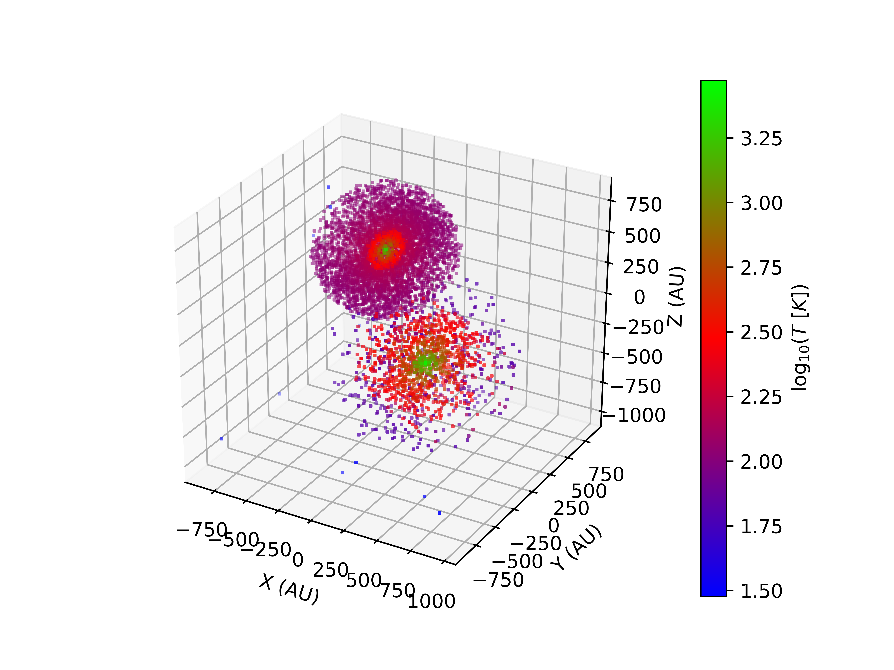

Modelling multiple star forming regions
=======================================

Example 1
---------

Source codes and figures on GitHub: `two_sources <https://github.com/andizq/star-forming-regions/tree/master/examples/two_sources>`_

The first 2 examples of the section 
`Modelling a single star forming region <http://star-forming-regions.readthedocs.io/en/latest/single_source/single_source.html>`_ 
will be used here to illustrate how to couple two (or more) models in a single **global grid**. 
The physical properties at the spatial region where two or more sub-models overlap 
are computed as explained in section 3.2 of `Izquierdo et al. 2018`_.

.. note:: 
   `W33A MM1-Main`: The most massive compact source of the complex star forming region W33A MM1. 
   
   `Model`: *Ulrich envelope + Pringle disc*.

   `Useful references`: `Galvan-Madrid+2010`_, `Maud+2017`_, `Izquierdo+2018`_

   **+**
   
   `Standard Hamburger`: Class 0/I Young Stellar Object with self-obscuration in the (sub)mm spectral indices.
   
   `Model`: *Ulrich envelope + Hamburger disc*.

   `Useful references`: `Lee+2017b`_, `Li+2017`_, Galvan-Madrid+2018 (Submitted to ApJ)

.. warning:: The execution codes for both compact sources are identical, except for the additions that are made explicit here. 
   	     **The following lines must be added after the definition of the Physical properties 
	     and for each compact source separately. Since we are going to overlap the models the writing-into-file process 
	     is slightly different (see below)**.

|

Additions for W33A MM1-Main
^^^^^^^^^^^^^^^^^^^^^^^^^^^

Since there is no longer an (isolated) single model, geometric changes may be required to better reproduce real scenarios. 
Let's add some lines to account for the centering, inclination and systemic velocity of each modelled region.

.. code-block:: python

   #-------------------------
   #ROTATION, VSYS, CENTERING
   #-------------------------
   xc, yc, zc = [-250*U.AU, 350*U.AU, 300*U.AU]
   CENTER = [xc, yc, zc] #New center of the region in the global grid
   v_sys = 3320. #Systemic velocity (vz) of the region (in m/s)
   newProperties = Model.ChangeGeometry(GRID, center = CENTER, vsys = v_sys,  vel = vel,
					rot_dict = { 'angles': [np.pi/4, 1.87*np.pi], 
						     'axis': ['x','z'] })

The ``GRID`` and ``vel`` objects should inherit their new state hosted in 
``newProperties`` as a result of the geometric and shifting modifications. 

.. code-block:: python

   GRID.XYZ = newProperties.newXYZ #Redefinition of the XYZ grid
   vel.x, vel.y, vel.z = newProperties.newVEL

The 3D plot of the modelled region, shifted and rotated:

.. code-block:: python

   #------------------------------------
   #3D PLOTTING (weighting with density)
   #------------------------------------
   tag = 'Main'
   weight = 10*Rho0
   r = GRID.rRTP[0] / U.AU #GRID.rRTP hosts [r, R, Theta, Phi] --> Polar GRID
   Plot_model.scatter3D(GRID, density.total, weight, 
   			NRand = 4000, colordim = r, axisunit = U.AU, 
			cmap = 'jet', colorscale = 'log', 
			colorlabel = r'${\rm log}_{10}(r [au])$', 
			output = '3Dpoints%s.png'%tag, show = False)

Finally, the writing command. In this case it's necessary to specify that the current 
model is actually a **sub-model** that will eventually be part of a **global-model**:

.. code-block:: python

   #-----------------------------------
   #WRITING DATA to file in LIME format
   #-----------------------------------
   tag = '_Main' #A tag to identify the final files from those of other sub-models
   Model.DataTab_LIME(density.total, temperature.total, vel, abundance, gtdratio, GRID,
		      is_submodel = True, tag = tag)

.. note:: Once a sub-model is defined for writing, a new folder named **Subgrids** 
   	  is created by default in the current working directory. 
   	  All the sub-model data files are stored there for future use in the merging process.

|

Additions for the Hamburger
^^^^^^^^^^^^^^^^^^^^^^^^^^^

Similarly for the Hamburger model:

.. code-block:: python

   #-------------------------
   #ROTATION, VSYS, CENTERING
   #-------------------------
   xc, yc, zc = [350*U.AU, -150*U.AU, -200*U.AU]
   CENTER = [xc, yc, zc] #Center of the region in the global grid
   v_sys = -2000. #Systemic velocity (vz) of the region (in m/s)
   newProperties = Model.ChangeGeometry(GRID, center = CENTER, vsys = v_sys,  vel = vel,
					rot_dict = { 'angles': [np.pi/2, np.pi/3], 
						     'axis': ['y','z'] })

   GRID.XYZ = newProperties.newXYZ #Redefinition of the XYZ grid
   vel.x, vel.y, vel.z = newProperties.newVEL

The 3D plot of the modelled region, shifted and rotated:

.. code-block:: python

   #----------------------------------------
   #3D PLOTTING (weighting with temperature)
   #----------------------------------------
   tag = 'Burger'
   weight = 10*T10Env

   vmin, vmax = np.array([5e11, 5e15]) / 1e6
   norm = colors.LogNorm(vmin=vmin, vmax=vmax)

   Plot_model.scatter3D(GRID, temperature.total, weight, 
   			NRand = 4000, colordim = density.total / 1e6, 
			axisunit = U.AU, cmap = 'jet', norm = norm,
			colorlabel = r'${\rm log}_{10}(r [au])$', 
			output = '3Dpoints%s.png'%tag, show = False)

And the writing command:

.. code-block:: python

   #-----------------------------------
   #WRITING DATA to file in LIME format
   #-----------------------------------
   tag = '_Burger' #A tag to identify the final files from those of other sub-models
   Model.DataTab_LIME(density.total, temperature.total, vel, abundance, gtdratio, GRID,
		      is_submodel = True, tag = tag)

|

Overlapping the sub-models
^^^^^^^^^^^^^^^^^^^^^^^^^^

Now that we have the data for each sub-model separately, we will invoke 
the library ``BuildGlobalGrid`` to overlap them in a single **global grid**.

You can overlap all the sub-models available in the ``./Subgrids`` folder, 
or tell the module explicitly the list of sub-models to consider:

.. code-block:: python

   #------------------
   #Import the package
   #------------------
   from sf3dmodels import BuildGlobalGrid as BGG, Model, Plot_model as Pm, Utils as U 
   #-----------------
   #Extra libraries
   #-----------------
   import numpy as np

   #---------------
   #DEFINE THE GRID
   #---------------
   sizex = sizey = sizez = 1000 * U.AU
   Nx = Ny = Nz = 120
   GRID = Model.grid([sizex, sizey, sizez], [Nx, Ny, Nz])

   #------------------
   #INVOKE BGG LIBRARY
   #------------------
   global_prop = BGG.overlap(GRID, all = True)

   """Instead of picking all the submodels (all = True) available in ./Subgrids you 
   can explicitly specify only those you want. The next two lines are equivalent to 
   the latter one:
   
   list_sub = ['datatab_Main.dat', 'datatab_Burger.dat']
   global_prop = BGG.overlap(GRID, submodels = list_sub)
   """

Plotting the result:

.. code-block:: python

   density = global_prop.density / 1e6 #cm^-3
   temperature = global_prop.temperature

   weight = 400 * np.mean(density)

   #-----------------
   #Plot for DENSITY
   #-----------------
   Pm.scatter3D(GRID, density, weight, NRand = 7000, axisunit = U.AU, 
   		colorscale = 'log', cmap = 'hot',
		colorlabel = r'${\rm log}_{10}(\rho [cm^{-3}])$', 
		output = 'global_grid_dens.png')

   #--------------------
   #Plot for TEMPERATURE
   #--------------------
   Pm.scatter3D(GRID, density, weight, colordim = temperature, 
   		NRand = 7000, axisunit = U.AU, colorscale = 'log',
		cmap = 'brg', colorlabel = r'${\rm log}_{10}(T$ $[K])$', 
		output = 'global_grid_temp.png')

